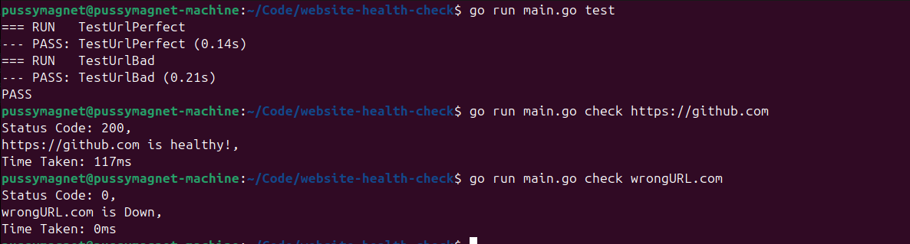

# Website Health Checker

A simple CLI tool designed to practice and revise **Go (Golang)** and **Go Testing** concepts. This tool allows you to check the status of websites directly from your terminal.

## Getting Started

### 1\. Installation

First, clone the repository to your local machine:

```bash
git clone <your-repository-url>
cd <repository-name>
```

### 2\. Basic Usage

To run the main application logic:

```bash
go run main.go
```

-----

## Command Reference

Below is a list of available commands to interact with the tool:

| Action | Command | Description |
| :--- | :--- | :--- |
| **Get Help** | `go run main.go help` | Displays help information and available commands. |
| **Check Website** | `go run main.go check [url]` | Checks the health status of a specific URL.<br>*Example:* `go run main.go check https://google.com` |
| **Run Tests** | `go run main.go test` | Runs the internal test cases for the application. |

-----

